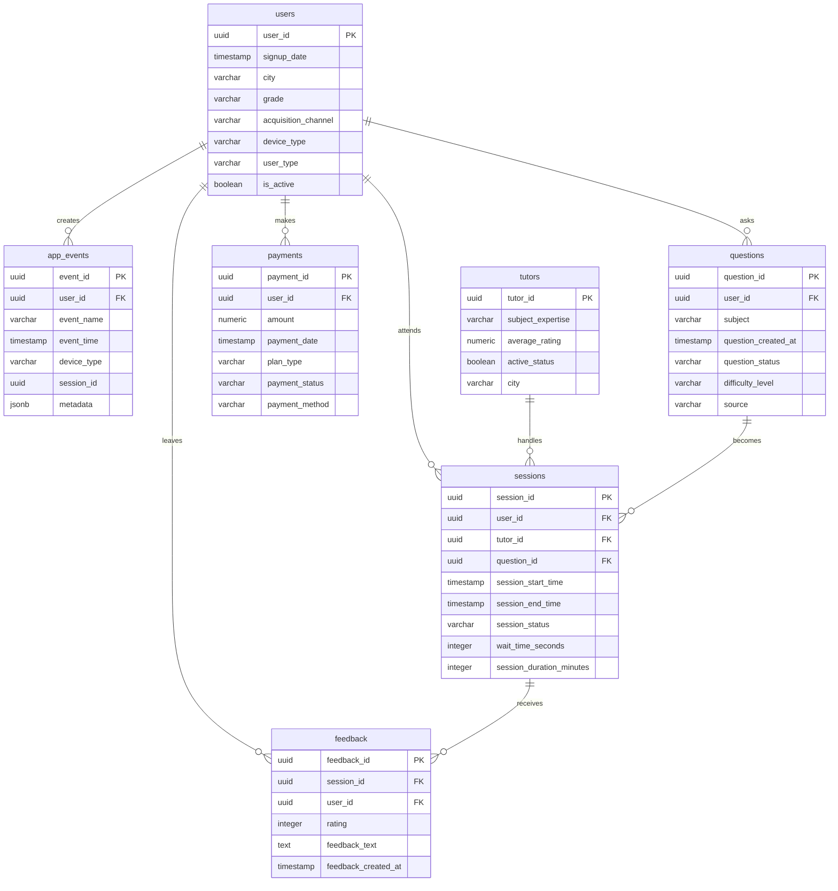

# ER Diagram

```mermaid
erDiagram
    users ||--o{ app_events : creates
    users ||--o{ questions : asks
    users ||--o{ sessions : attends
    users ||--o{ payments : makes
    users ||--o{ feedback : leaves
    tutors ||--o{ sessions : handles
    questions ||--o{ sessions : becomes
    sessions ||--o{ feedback : receives

    users {
        uuid user_id PK
        timestamp signup_date
        varchar city
        varchar grade
        varchar acquisition_channel
        varchar device_type
        varchar user_type
        boolean is_active
    }

    app_events {
        uuid event_id PK
        uuid user_id FK
        varchar event_name
        timestamp event_time
        varchar device_type
        uuid session_id
        jsonb metadata
    }

    questions {
        uuid question_id PK
        uuid user_id FK
        varchar subject
        timestamp question_created_at
        varchar question_status
        varchar difficulty_level
        varchar source
    }

    tutors {
        uuid tutor_id PK
        varchar subject_expertise
        numeric average_rating
        boolean active_status
        varchar city
    }

    sessions {
        uuid session_id PK
        uuid user_id FK
        uuid tutor_id FK
        uuid question_id FK
        timestamp session_start_time
        timestamp session_end_time
        varchar session_status
        integer wait_time_seconds
        integer session_duration_minutes
    }

    payments {
        uuid payment_id PK
        uuid user_id FK
        numeric amount
        timestamp payment_date
        varchar plan_type
        varchar payment_status
        varchar payment_method
    }

    feedback {
        uuid feedback_id PK
        uuid session_id FK
        uuid user_id FK
        integer rating
        text feedback_text
        timestamp feedback_created_at
    }
```

